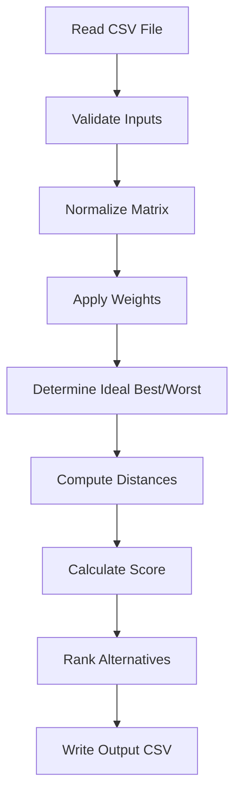
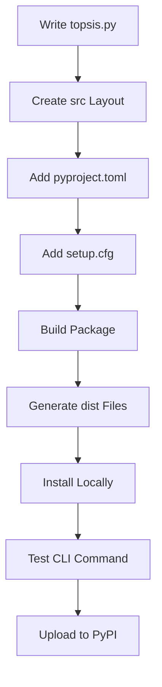
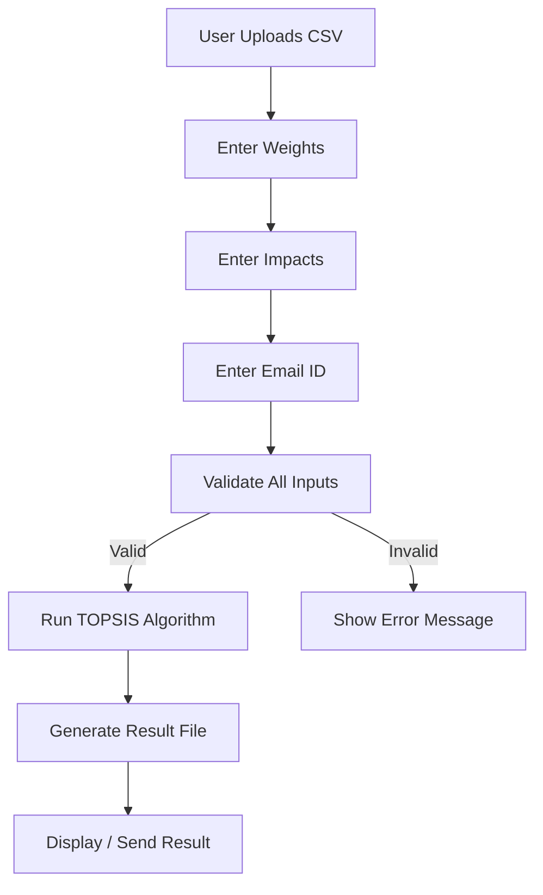

# Topsis-Suwan-102317217

A Python implementation of the TOPSIS (Technique for Order Preference by Similarity to Ideal Solution) method with full command-line support and PyPI packaging.

This project demonstrates:

- Implementation of the TOPSIS algorithm
- Command-line interface using `sys.argv`
- Input validation and error handling
- Packaging using modern `pyproject.toml`
- Building distribution files
- Publishing to PyPI

---

## 1. Project Overview

TOPSIS is a multi-criteria decision-making (MCDM) technique used to rank alternatives based on their distance from an ideal best and ideal worst solution.

The implemented workflow:

1. Normalize the decision matrix
2. Multiply by weights
3. Determine ideal best and worst
4. Compute Euclidean distance from ideal solutions
5. Calculate performance score
6. Rank alternatives

---

## 2. Command Line Usage

After installation:

```bash
topsis <input.csv> "<weights>" "<impacts>" <output.csv>
```

Example:

```bash
topsis input.csv "0.2,0.2,0.2,0.2,0.2" "+,-,+,-,-" output.csv
```

### Input Requirements

- First column must contain alternative names
- Remaining columns must be numeric
- At least 3 columns required
- Weights must be comma-separated
- Impacts must be `+` or `-`
- Number of weights and impacts must match criteria columns

---

## 3. Example Input File

```csv
Fund Name,P1,P2,P3,P4,P5
M1,0.84,0.71,6.7,42.1,12.59
M2,0.91,0.83,7,31.7,10.11
M3,0.79,0.62,4.8,46.7,13.23
M4,0.78,0.61,6.4,42.4,12.55
M5,0.94,0.88,3.6,62.2,16.91
M6,0.88,0.77,6.5,51.5,14.91
M7,0.66,0.44,5.3,48.9,13.83
M8,0.93,0.86,3.4,37,10.55
```

---

## 4. Example Output

| Fund Name | P1  | P2  | P3 | P4  | P5   | Topsis Score | Rank |
|------------|-----|-----|----|-----|------|---------------|------|
| M6 | 0.88 | 0.77 | 6.5 | 51.5 | 14.91 | 0.738148132 | 1 |
| M5 | 0.94 | 0.88 | 3.6 | 62.2 | 16.91 | 0.641885815 | 2 |
| M1 | 0.84 | 0.71 | 6.7 | 42.1 | 12.59 | 0.56369233 | 3 |
| M2 | 0.91 | 0.83 | 7   | 31.7 | 10.11 | 0.513032103 | 4 |
| M4 | 0.78 | 0.61 | 6.4 | 42.4 | 12.55 | 0.491956082 | 5 |
| M3 | 0.79 | 0.62 | 4.8 | 46.7 | 13.23 | 0.439177283 | 6 |
| M8 | 0.93 | 0.86 | 3.4 | 37   | 10.55 | 0.408498677 | 7 |
| M7 | 0.66 | 0.44 | 5.3 | 48.9 | 13.83 | 0.407389532 | 8 |

---

## 5. Project Structure

```
Topsis-Suwan-102317217/
│
├── src/
│   └── TopsisSuwan102317217/
│       ├── __init__.py
│       └── topsis.py
│
├── README.md
├── LICENSE
├── pyproject.toml
├── setup.cfg
```

---

## 6. Packaging Configuration

### pyproject.toml

Key configuration:

- Uses `setuptools`
- Defines dependencies: `pandas`, `numpy`
- Registers CLI entry point
- Uses `src` layout

Important section:

```toml
[project.scripts]
topsis = "TopsisSuwan102317217.topsis:main"

[tool.setuptools.packages.find]
where = ["src"]
```

---

## 7. Development Pipeline

### 7.1 Algorithm Flow



---

### 7.2 Packaging and Distribution Flow



---

## 8. Building the Package Locally

Install build tool:

```bash
pip install build
```

Build:

```bash
python -m build
```

This generates:

```
dist/
    topsis_suwan_102317217-0.0.1.tar.gz
    topsis_suwan_102317217-0.0.1-py3-none-any.whl
```

---

## 9. Installing Locally

```bash
pip install dist/topsis_suwan_102317217-0.0.1-py3-none-any.whl
```

---

## 10. Uploading to PyPI

Install twine:

```bash
pip install twine
```

Upload:

```bash
twine upload dist/*
```

---

## 11. Installing from PyPI

After publication:

```bash
pip install Topsis-Suwan-102317217
```

Then run:

```bash
topsis input.csv "0.2,0.2,0.2,0.2,0.2" "+,-,+,-,-" output.csv
```

---

## 12. Dependencies

- pandas
- numpy
- Python >= 3.8

---

## 13. License

MIT License

---

## 14. Conclusion

This project demonstrates the complete lifecycle of:

- Algorithm implementation
- CLI development
- Modern Python packaging
- Local build testing
- Distribution through PyPI
- Reproducible installation

---

# 15. Part II – Web Service using Streamlit

In addition to the command-line interface, this project also includes a web-based implementation of TOPSIS using Streamlit.

This web application allows users to:

- Upload a CSV file
- Enter weights
- Enter impacts
- Provide an email ID
- Generate the TOPSIS result file

The web interface validates all inputs before processing.

---

## 15.1 Functional Requirements

The web service ensures:

- User must upload an input CSV file
- Number of weights must equal number of criteria columns
- Number of impacts must equal number of criteria columns
- Impacts must be either `+` or `-`
- Weights must be comma-separated numeric values
- Email ID format must be valid
- Result file is generated only after successful validation

---

## 15.2 Web Application Flow



---

## 15.3 Running the Web Application Locally

Activate virtual environment:

```bash
.venv\Scripts\activate
```

Install required dependencies:

```bash
pip install streamlit pandas numpy
```

Run the application:

```bash
streamlit run app.py
```

After running, open:

```
http://localhost:8501
```

The web interface will be available in the browser.

---

## 15.4 Web Project Structure

```
Topsis-Suwan-102317217/
│
├── app.py
├── src/
│   └── TopsisSuwan102317217/
│       ├── __init__.py
│       └── topsis.py
│
├── README.md
├── pyproject.toml
├── setup.cfg
```

---

## 15.5 Integration with Core Algorithm

The Streamlit application reuses the same TOPSIS implementation from:

```
TopsisSuwan102317217/topsis.py
```

This ensures:

- No duplication of logic
- Consistent ranking results
- Single source of truth for algorithm implementation

---

## 15.6 Deployment (Optional)

The Streamlit application can be deployed using:

- Streamlit Community Cloud
- Render
- Railway
- Any cloud VM running Python

Basic deployment steps:

1. Push project to GitHub
2. Connect repository to Streamlit Cloud
3. Set entry file as `app.py`
4. Deploy

---

This completes the second part of the assignment by providing a user-friendly web interface for the TOPSIS algorithm.


The repository serves as both an academic submission and a reproducible packaging reference.
